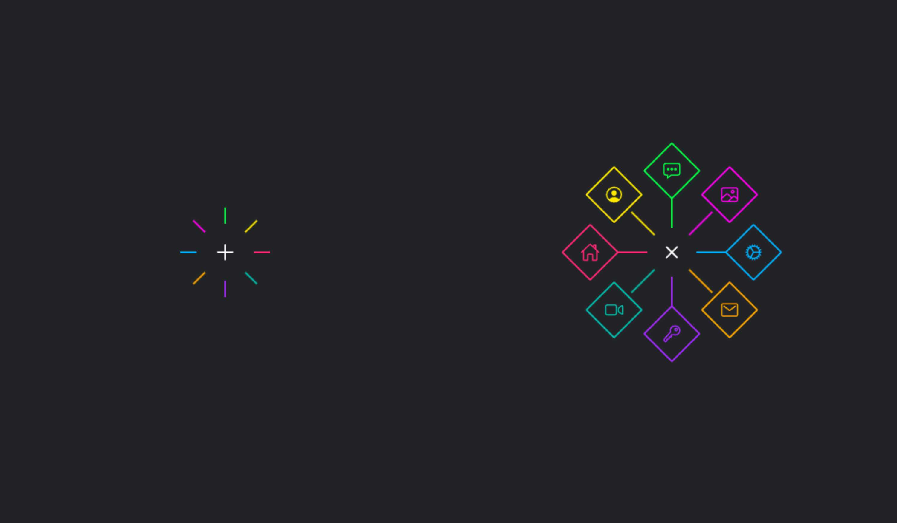

# Menu Radial Animado

## Sobre o projeto

Um menu radial animado em formato octogonal, no qual ao clicar no botão "+" exibe uma animação e em seguida mostra 8 botões que ao clicar realizam uma ação determinada

## Informações

Projeto desenvolvido utilizando apenas HTML, CSS e JavaScript.

